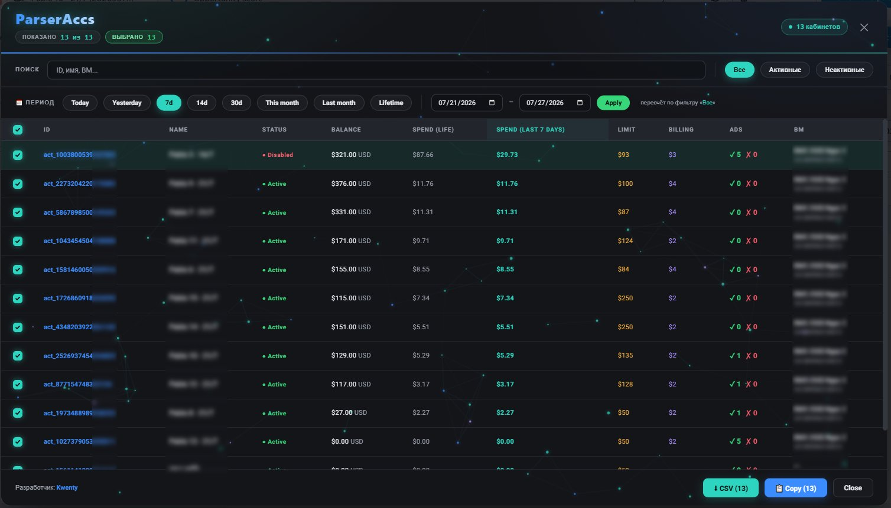
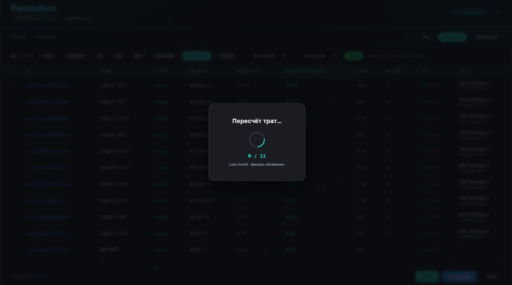
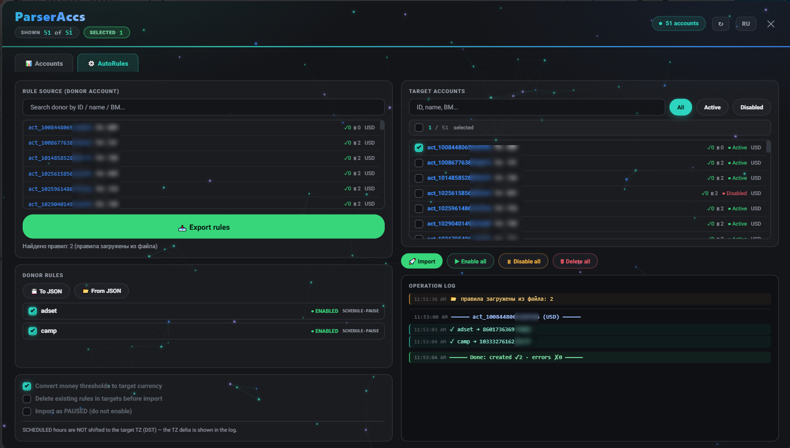

**🇷🇺 Русский** · [🇬🇧 English](#english)

 

**ParserAccs** — букмарклет, который читает все рекламные кабинеты Facebook Ads Manager пачкой и складывает их в одну живую таблицу: баланс, траты за любой период, дневные лимиты, пороги биллинга, статусы объявлений и привязку к Business Manager. А вторая вкладка переносит автоправила между кабинетами — с пересчётом денежных порогов под валюту каждой цели.

Ничего не устанавливается. Одна закладка — и инструмент ваш.

---

## ⚡ Установка за 10 секунд

1. Откройте лендинг: **[kw3nty.github.io/ParserAccs](https://kw3nty.github.io/ParserAccs/)**
2. Покажите панель закладок браузера — `Ctrl+Shift+B` (Mac: `⌘+Shift+B`).
3. **Перетащите** бирюзовую кнопку `📌 ParserAccs` с лендинга на панель закладок. Готово.
4. Откройте Ads Manager → кликните по закладке.

> На телефоне или если drag не сработал — на лендинге есть кнопка **«Скопировать код»**: создайте закладку вручную и вставьте код в поле адреса.
> Тумблер **RU / EN** на лендинге задаёт язык *устанавливаемой* закладки — перетащите кнопку в нужном положении. Внутри парсера язык переключается кнопкой **🌐** в шапке и запоминается.

При обновлении скрипта создавайте закладку заново (или полностью заменяйте её URL) — правки длинного `javascript:`‑кода некоторые браузеры молча не сохраняют.

---

## 📊 Вкладка «Кабинеты»

Парсинг идёт через официальный Graph API и только читает данные — в кабинетах ничего не меняется.

- **Сводка в одну таблицу** — ID, имя, статус, баланс с валютой, траты за всё время и за выбранный период, дневной лимит (`∞`, если без лимита), порог биллинга, счётчики активных и отклонённых объявлений, привязанный BM.
- **Периоды** — Today · Yesterday · 7 / 14 / 30 дней · This month · Last month · Lifetime и произвольный диапазон дат. Популярные периоды берутся из кэша мгновенно; «тяжёлые» считаются на лету — при этом всплывает оверлей пересчёта *поверх* окна, а таблица остаётся на месте.
- **Фильтры и поиск** — Все / Активные / Неактивные плюс поиск по ID, имени кабинета и имени или ID BM. Сортировка — кликом по любой колонке.
- **Выделение** — кастомные чекбоксы с пружинным откликом; чекбокс в заголовке таблицы выделяет и снимает все видимые строки одним кликом. Выделение живёт между сменами фильтра, поиска и сортировки.
- **Экспорт** — `📋 Copy IDs` и `⬇ CSV` работают по выделенным кабинетам, а если ничего не выделено — по всем видимым. CSV сразу разъезжается по столбцам в Excel (UTF‑8 BOM + подсказка `sep=,`).
- **Обновление без закрытия** — кнопка `↻` в шапке пересобирает все данные оверлеем поверх модалки, сохраняя выделение, фильтр и сортировку.
- **Прямые ссылки** на каждый кабинет ведут ровно в него — без параметра `business_id`, который раньше вызывал редирект на чужой кабинет.

### Колонки CSV

| Колонка | Значение |
|---|---|
| `ID` | ID рекламного кабинета |
| `Name` | Название кабинета |
| `Status` | Active / Disabled / Unsettled / Review / Pending / Grace / … |
| `Balance` / `Currency` | Баланс и валюта |
| `Spend Life` | Траты за всё время |
| `Spend Period` / `Period` | Траты за выбранный период и его название |
| `Limit` | Дневной лимит (`INF`, если без лимита) |
| `Billing` | Порог биллинга |
| `Ads OK` / `Ads No` | Активные и отклонённые объявления |
| `BM Name` / `BM ID` | Привязанный Business Manager |

---

## ⚙️ Вкладка «AutoRules»

Менеджер автоправил: экспорт из кабинета‑донора и импорт в выбранные цели — по логике Ad Rules Engine Meta. В отличие от парсера, здесь идёт **запись** в кабинеты (создание, удаление и смена статуса правил), поэтому на все деструктивные действия стоит подтверждение. Сами рекламные кампании правила не запускают — они лишь управляют существующими объектами по заданным условиям.

- **Донор** — поиск кабинета‑источника по ID / имени / BM и кнопка `📥 Экспорт правил`. Рядом с каждым кабинетом в списках подгружаются счётчики правил `✓N ⏸M` (включено / выключено).
- **Правила донора** — список с чекбоксами: отмечаете, какие правила переносить.
- **Целевые кабинеты** — поиск, фильтр Все / Активные / Неактивные, чекбокс‑заголовок «выделить / снять все видимые» и счётчики правил у каждой цели.
- **Импорт** — `🚀 Импортировать` создаёт выбранные правила во всех отмеченных целях через `POST /act_{id}/adrules_library`.
- **Конвертация валют** — денежные пороги в условиях (`spent`, `cost_per_*`, CPA/CPC/CPM и т. п.) пересчитываются под валюту каждой цели через USD как промежуточную, с учётом «центовых» оффсетов валют. ROAS, CTR и охваты не трогаются.

    | Валюта | Оффсет | Примеры |
    |---|---|---|
    | `1` | без центов | JPY, KRW, VND, CLP, COP, HUF, ISK, IDR |
    | `100` | стандарт | USD, EUR, RUB, UAH, TRY, GBP, … |
    | `1000` | три знака | BHD, KWD, OMR, JOD, TND |

- **Опции импорта** — конвертировать пороги (вкл. по умолчанию), удалить существующие правила в целях перед импортом, импортировать как PAUSED (не включать).
- **Массовые действия** — `▶ Включить все`, `⏸ Выключить все`, `🗑 Удалить все` по выбранным целям.
- **JSON‑перенос** — `💾 В JSON` сохраняет отмеченные правила в файл (в USD‑базе, без ID донора), `📂 Из JSON` загружает их обратно. Файл валютонезависим: правила от донора в RUB, загруженные в цель в USD или TRY, пересчитаются корректно. Так правила переносятся между разными токенами и браузерами.
- **Таймзоны** — часы расписания `SCHEDULED` намеренно *не* сдвигаются под цель (фиксированный сдвиг ломается из‑за перехода на летнее время), а разница поясов донора и цели показывается в логе как ориентир для ручной проверки.
- **Цветной лог** — каждая операция раскрашена по типу (создание, ошибка, разделитель кабинета, предупреждение, итог) и въезжает с микро‑анимацией.

---

## 🌐 Языки и лендинг

Интерфейс полностью двуязычный — **RU и EN**.

- Дефолтный язык берётся из настроек браузера (`navigator.language`), а не по IP — это важно для арбитражников за прокси, где геолокация всегда US.
- Тумблер **RU / EN** на лендинге определяет язык *закладки*, которую вы перетаскиваете.
- Кнопка **🌐** в шапке парсера меняет язык на лету, без потери загруженных данных, и пишет выбор в `localStorage`.
- Лендинг — одностраничник на GitHub Pages с фоновой анимацией частиц, секциями «как установить / что умеет / скрины» и кнопкой‑букмарклетом для drag&drop. Хостинг бесплатный, адрес — `kw3nty.github.io/ParserAccs` 
---

## ❓ Частые вопросы

**Ссылка на кабинет ведёт не туда.** Обновите закладку — ссылки теперь в прямом формате `…/campaigns?act=<число>` без `business_id`, который и вызывал редирект.

**CSV открывается в Excel одной колонкой.** В актуальной версии в начало файла пишется `sep=,` — Excel сам разбивает столбцы. На старой закладке — обновите её.

**Поиск не находит кабинет по букве.** Проверьте раскладку: имена и BM обычно в латиннице, а русская «В» и латинская `B` — разные символы.

**При импорте правил ошибка про PAUSE и стоимость.** Это ограничение самого Facebook: правило с действием PAUSE не может иметь условий по стоимости. Такое правило нужно поправить в доноре — лог покажет точное сообщение Meta по каждому правилу.

**Это безопасно?** Парсер делает только GET‑запросы к официальному Graph API и обрабатывает данные локально в браузере, ничего не отправляя на сторонние серверы. Вкладка AutoRules пишет правила в *ваши* кабинеты через *ваш* токен — и всегда с подтверждением. Вы используете инструмент на свой риск.

---

## 📁 Структура репозитория

- `parseraccs.js` — код букмарклета (один файл, одна точка поддержки; лендинг подтягивает его сам).
- `index.html` — лендинг на GitHub Pages.
- `README.md` — этот файл.
- `LICENSE` — MIT.
- `preview.jpg`, `recount.png` — скрины интерфейса.

---

## 🛠 Токен доступа

Скрипт подхватывает токен автоматически из открытой страницы Ads Manager. Если не получилось — попросит ввести его вручную (`EAAB…`); токен используется только для запросов к Graph API от вашего имени и никуда не передаётся.

---

🇷🇺 Сделал [Kwenty](https://t.me/kw33nty) · 🇬 Built by [Kwenty](https://t.me/kw33nty) · [GitHub](https://github.com/Kw3nty/ParserAccs) · MIT

[🇬 English ↓](#english) · [⬆ Наверх](#top)

---
---

**[🇷🇺 Русский](#top)** · **🇬🇧 English**

**ParserAccs** is a bookmarklet that reads every Facebook Ads Manager account in bulk and lays them out in one living table — balance, spend for any period, daily limits, billing thresholds, ad status and Business Manager mapping. A second tab moves automated rules between accounts, converting money thresholds into each target's currency.

No install. One bookmark and it's yours.

### ⚡ Install in 10 seconds

1. Open the landing page: **[kw3nty.github.io/ParserAccs](https://kw3nty.github.io/ParserAccs/)**
2. Show the bookmarks bar — `Ctrl+Shift+B` (Mac: `⌘+Shift+B`).
3. **Drag** the teal `📌 ParserAccs` button onto the bookmarks bar. Done.
4. Open Ads Manager and click the bookmark.

> On mobile, or if drag fails, use the **“Copy code”** button on the landing page and paste the code into a new bookmark's URL field.
> The **RU / EN** toggle on the landing page sets the language of the *bookmark you install* — drag the button while the toggle is in the position you want. Inside the parser, the **🌐** button switches language on the fly and remembers it.

When updating the script, create the bookmark anew (or fully replace its URL) — some browsers silently fail to save edits to long `javascript:` code.

### 📊 The Accounts tab

Read‑only, via the official Graph API — nothing in your accounts is changed.

- **One table for everything** — ID, name, status, balance with currency, lifetime and period spend, daily limit (`∞` if unlimited), billing threshold, active and disapproved ad counts, linked BM.
- **Periods** — Today · Yesterday · 7 / 14 / 30 days · This month · Last month · Lifetime and a custom date range. Popular periods are instant from cache; heavier ones recompute on the fly behind an overlay that floats *over* the window while the table stays put.
- **Filters & search** — All / Active / Disabled plus search by ID, account name and BM name or ID. Click any column to sort.
- **Selection** — custom checkboxes with a springy response; the header checkbox selects and clears all visible rows in one click. Selection survives filter, search and sort changes.
- **Export** — `📋 Copy IDs` and `⬇ CSV` act on the selected accounts, or on all visible ones when nothing is selected. The CSV splits into columns in Excel on open (UTF‑8 BOM + the `sep=,` hint).
- **Refresh without closing** — the `↻` button in the header reloads all data via an overlay on top of the modal, keeping your selection, filter and sort.
- **Direct links** open each account exactly — without the `business_id` parameter that used to redirect to a different account.

### ⚙️ The AutoRules tab

A rules manager: export from a donor account and import into chosen targets, following Meta's Ad Rules Engine. Unlike the parser, this tab *writes* to accounts (create, delete and toggle rules), so every destructive action asks for confirmation. The rules themselves don't launch campaigns — they only act on existing objects by the conditions you set.

- **Donor** — search the source account by ID / name / BM, then `📥 Export rules`. Each account in the lists shows a live rule counter `✓N ⏸M` (enabled / disabled).
- **Donor rules** — a checklist of which rules to carry over.
- **Target accounts** — search, an All / Active / Disabled filter, a header checkbox to select or clear all visible targets, and per‑target rule counters.
- **Import** — `🚀 Import` creates the chosen rules in every ticked target via `POST /act_{id}/adrules_library`.
- **Currency conversion** — money thresholds in conditions (`spent`, `cost_per_*`, CPA/CPC/CPM, …) are reconverted into each target's currency through USD as the pivot, respecting each currency's cent offset. ROAS, CTR and reach metrics are left untouched.
- **Import options** — convert thresholds (on by default), delete existing rules in targets before import, import as PAUSED.
- **Bulk actions** — `▶ Enable all`, `⏸ Disable all`, `🗑 Delete all` across the selected targets.
- **JSON transfer** — `💾 To JSON` saves the ticked rules to a file (in a USD base, without the donor's IDs); `📂 From JSON` loads them back. The file is currency‑agnostic, so rules exported from a RUB donor and loaded into a USD or TRY target reconvert correctly. This is how rules travel between different tokens and browsers.
- **Time zones** — `SCHEDULED` hours are intentionally *not* shifted to the target (a fixed offset breaks across daylight‑saving transitions); the donor/target zone delta is printed in the log as a hint for a manual check.
- **Coloured log** — every operation is tinted by type (created, error, account separator, warning, summary) and slides in with a small animation.

### 🌐 Languages & landing page

The UI is fully bilingual — **RU and EN**. The default follows the browser language (`navigator.language`), not the IP — which matters behind proxies where geo always reads US. The landing‑page toggle sets the language of the bookmark you drag; the **🌐** button inside the parser switches on the fly and persists to `localStorage`. The landing page itself is a single‑page site on GitHub Pages with a particle background, install / features / screenshots sections and a drag‑and‑drop bookmarklet button, served for free at `kw3nty.github.io/ParserAccs`

### ❓ FAQ

**Account link goes to the wrong place.** Update the bookmark — links now use the direct `…/campaigns?act=<number>` format without `business_id`, which caused the redirect.

**CSV opens as one column in Excel.** The current version writes `sep=,` at the top so Excel splits the columns. On an old bookmark, update it.

**Search misses an account by a letter.** Check your keyboard layout — names and BMs are usually Latin, and Cyrillic “В” and Latin `B` are different characters.

**Rule import complains about PAUSE and cost.** That's Facebook's own rule: a PAUSE action can't carry cost conditions. Fix that rule in the donor — the log shows Meta's exact message per rule.

**Is it safe?** The parser makes only GET requests to the official Graph API and processes data locally in the browser, sending nothing to third parties. The AutoRules tab writes rules into *your* accounts with *your* token — and always with a confirmation. You use the tool at your own risk.

🇷🇺 Built by [Kwenty](https://t.me/kw33nty) · 🇬🇧 Built by [Kwenty](https://t.me/kw33nty) · [GitHub](https://github.com/Kw3nty/ParserAccs) · MIT

[🇷🇺 Русский ↑](#top) · [⬆ Top](#top)

